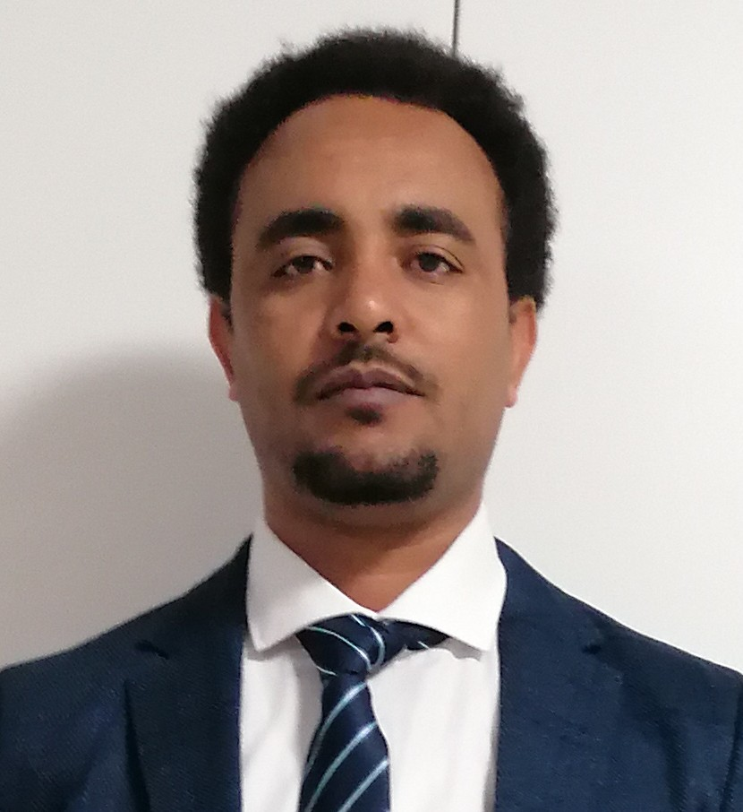

# Hello from Tesfay 👋

- [jpg).jpg](#jpg)

---

# About me

Hello everyone! My origin is from Ethiopia. I came to Belgium in 2019. By
profession i'm **Biotechnologist** with teaching in higher education and
research experience. I taught biotechnology related courses for more than 8
years in Ethiopia and elaborated my research experience at KU Leuven, Belgium. I
have deep passion in IT sector particularly **web development** based
applications. **HYF Belgium** gave me this golden opportunity to be trained in
**fullstack development**. This will help me to take my skills to the next
level. I am pleased to talk to you and discuss and you can reach me through my
contact information below.

---

### Work Experience

- Doctoral research student : KU Leuven, Leuven, Belgium 09/2019 – 08/2022
- Full time Lecturer : Applied Biology, ASTU, Adama, Ethiopia 09/2008– 08/2019

---

### Education History

- **Master of Biotechnology (MBT)** (Medical Biotechnology): Wageningen
  University, The Netherlands. 2012 – 2014
- **Bachelor of Sciences (BSc.) in Applied Biology**: University of Gondar,
  Ethiopia. 2005 – 2008

---

### Trainings and Certificaions

- Emerging Technologies:IBM
- Web Development Fundamentals: IBM
- Data Fundamentals: IBM

## Contact information

- **LinkedIn:** <linkedin.com/in/haftu-abraha-tesfay>
- **E-mail:** <tesfay.haftu1989@gmail.com>
- **phone:** +32483331013
